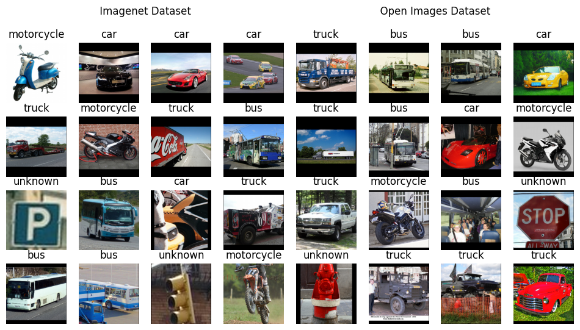

Computer Vision Assignment 2

Memory Constrained Image Classification

Anirudh Sharma | Computer Vision | 17th March 2026

# Introduction

This project focuses on building an image classification model for
vehicle recognition. The model predicts one of five classes: Bus, Truck,
Car, Bike, or None of the above.

The main constraints are:

- Model size must be under 5 MB

- Input images can vary in size (32×32 to 256×256)

Initially, no dataset was provided, so the data pipeline was built from
scratch using Open Images, and later on with ImageNet. These datasets
required custom handling due to differences in format and labeling.

Multiple models were experimented with, including simple CNNs and
transfer learning approaches. A MobileNet-based architecture was used in
the final solution due to its efficiency and small size.

The project mainly focuses on building a complete pipeline, including
data processing, sample generation, model training, and evaluation.

# Problem Definition

The task is to build an image classification model that categorizes an
input image into one of the following five classes:

- 0: Bus

- 1: Truck

- 2: Car

- 3: Bike

- 4: None of the above

The input images can vary in size between 32×32 and 256×256. The main
object to be classified is assumed to be the dominant object in the
image. Therefore, This is strictly a classification problem. Object
detection or localization (e.g., bounding boxes) is not required for the
final prediction.

The model must satisfy the following constraints:

- The final model size must be less than 5 MB

- The model should generalize across different image resolutions and
  variations

- The output of the system is a single class label (0–4) for each input
  image.

# Dataset Construction

## Motivation

No dataset was provided for this task, so the dataset had to be
constructed manually. The main requirements were:

- Sufficient samples for each vehicle class

- A meaningful “None of the above” class

- Diversity in images for better generalization

To address this, two datasets were used: Open Images and ImageNet.

## Open Images Dataset

The Open Images dataset was used as the primary dataset because it
provides bounding box annotations and a wide variety of classes.

The following classes were selected for the main categories:

- Bus: bus

- Truck: truck

- Car: car

- Bike: motorcycle

For the “None of the above” class, multiple unrelated classes were used:
bench, cat, dog, fire\_hydrant, parking\_meter, person, piano,
stop\_sign, traffic\_light, and traffic\_sign.

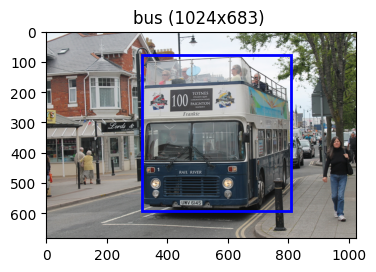

### Data Distribution

For the main vehicle classes:

- ~1500 images for training

- ~300 images for validation

- ~900 images for testing

For the “None” class:

- ~250 images per class per split

- Total ≈ 2500 images per split

This dataset was mainly used for training the full 5-class model.

## ImageNet Dataset

ImageNet was used to supplement the dataset with a larger number of
clean, labeled images for the main vehicle classes.

Each class was mapped using multiple synsets. For example:

- Bus: minibus, school bus, trolleybus

- Truck: fire truck, garbage truck, pickup truck, tow truck, trailer
  truck

- Car: station wagon, automobile, passenger car, race car, sports car,
  jeep

- Bike: mountain bike, motorcycle, tandem bicycle

On average, each synset contains around 1200 images, making ImageNet
significantly larger than Open Images for these classes.

No extra classes were loaded to cater for “None”, this dataset was used
to better train the classifier part of the model.

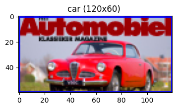

## Dataset Challenges

The use of multiple datasets introduced several challenges:

- Different formats

  - Open Images provides bounding boxes

  - ImageNet provides full images without localization

- Class imbalance

  - The “None” class required manual construction

  - Different datasets had different distributions

- Inconsistent structure

  - Required separate data loading logic for each dataset

Because of these issues, custom dataset loaders and preprocessing
pipelines were implemented to unify the data before training.

# Data Processing Pipeline

## Design Overview

Since the datasets used have different formats and structures, a unified
data pipeline was required. The main idea was to convert all data into a
consistent representation before feeding it into the model.

Each image is represented using a descriptor object containing:

- Image path

- Class label

- Bounding box (if available)

This abstraction allows both datasets to be handled in a uniform way.

## Dataset Manager

Custom dataset classes were implemented to handle different data
sources:

- OIDv6Dataset (Open Images)

  - Reads images along with bounding box annotations

  - Supports filtering and structured loading

- IMDataset (ImageNet)

- Handles class mapping using synsets

- Since no bounding boxes are available, a default box covering the full
  image is used

Both datasets support:

- Subsampling for faster experimentation

- Class balancing when required

## Pipelined Dataset

The PipelinedDataset acts as an intermediate layer that standardizes
outputs from different datasets.

Key features:

- Applies preprocessing functions

- Supports caching for faster repeated access

- Ensures uniform output format

- Scales image values to the \[0, 1\] range

This component helps decouple raw data loading from transformation
logic.

## Alternating Dataset

To train on both datasets simultaneously, an AlternatingDataset was
introduced.

- Alternates samples between Open Images and ImageNet

- Provides a unified stream of training data

- Helps combine:

  - Rich object-focused samples (Open Images)

  - Large-scale clean samples (ImageNet)

This approach allowed training a single model using both datasets
without merging them explicitly.

# Sample Generation and Transformations

## Motivation

The Open Images dataset does not provide object-focused images. Each
image can contain multiple objects with bounding boxes.

To make the data suitable for classification, it was necessary to
generate object-centric samples from these images. This also helped in
creating samples for the “None” class.

## Core Transformations

Several basic transformations were implemented to prepare images:

- Padding (pad\_up\_sample)  
  Adjusts image size so that width and height are multiples of a given
  factor

- Rescaling (rescale\_sample)  
  Supports scaling by factor, fixed width, or target size

- Bounding box based cropping:

  - context\_crop\_sample: crops around the object with adjustable
    margin

  - center\_crop\_sample: creates a square crop centered on the object

These transformations help in focusing on relevant regions of the image.

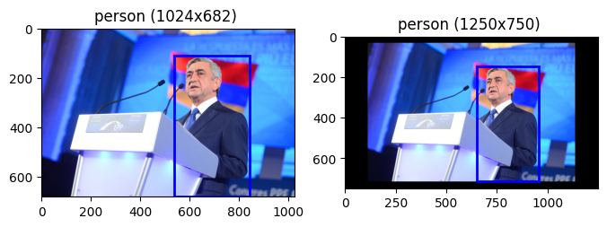  
Example of pad\_up\_sample

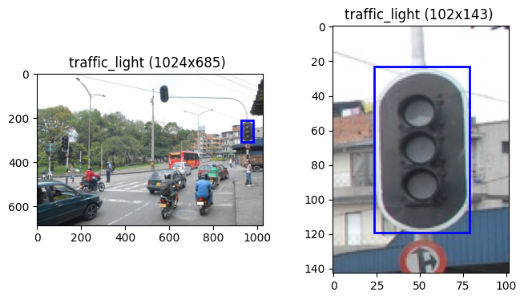  
Example of context\_crop\_sample

## Sliding Window Sampling

A multi-scale sliding window approach was used to generate multiple
samples.

- Fixed-size windows are moved across the image

- Stride is set to half of the window size

- Multiple crops are generated from different regions

Each generated sample is assigned a label based on how much of the
object is present.

This process produces:

- Positive samples (object present)

- Negative samples (background or unrelated regions)

In some cases, soft labels are computed based on overlap between the
crop and object, normalized by both object size and crop size.

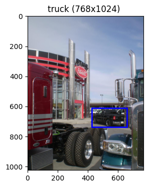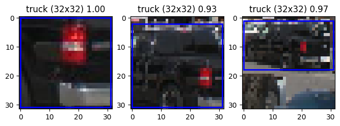  
Example of Sliding Window Sampling

## Pipeline Variants

Different combinations of the above transformations were used across
experiments.

- Not all methods were applied together

- Pipelines were adjusted based on:

  - Dataset type

  - Model being trained

  - Experiment goals

The final model uses a standardized input size of 224×224, although
intermediate sampling sizes varied during experimentation.

# Model Architectures

## SmallCNN

This was the initial baseline model used for quick testing.

Architecture:

- Conv (16) + ReLU + MaxPool

- Conv (32) + ReLU + MaxPool

- Fully Connected (128) + ReLU

- Fully Connected (5)

This model was mainly used to verify that the data pipeline and training
loop were working correctly.

## SimpleCNN

A more flexible CNN was implemented with parameterized layers.  
Allows changing number of layers and channels  
Uses a helper function get\_out to compute output dimensions  
This model was used for experimentation and tuning different
configurations.

## MobileNetCNN

This model uses transfer learning with a pretrained MobileNetV3 Small.  
Final layer modified to output 5 classes

Chosen due to:

- Small model size

- Good performance for lightweight tasks

- This served as the main baseline for the final solution.

## WhatAmIDoingCNN

This model was an experimental extension built on top of MobileNetV3
Small.

Instead of directly using the classifier:

- The final classification layer was replaced with an identity layer

- The model outputs a 576-dimensional feature vector

Two separate heads were added:

- Classifier

  - Linear (576 → 256)

  - Hardtanh

  - Dropout (0.2)

  - Linear (256 → number of classes)

- Discriminator

  - Linear (576 → 1)

The model outputs both:

- Classification output (vehicle classes)

- Discriminator output (known vs unknown)

The idea was to explicitly model the “None of the above” class as an
unknown category instead of treating it as a regular class.

This required changes in the training logic and led to several
iterations and refactors during experimentation.

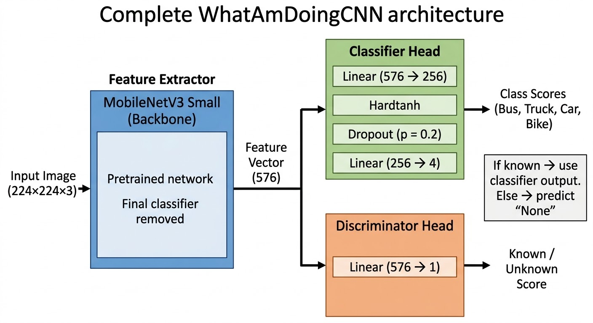

# Training Framework

## Training Manager

A custom training manager was used to handle the training process. This
is a reusable utility that was extended for this project.

Key features:

- Supports training and validation loops

- Handles checkpoint saving and loading

- Logs training progress and metrics

- Provides ETA estimates during training

- Allows custom loss computation logic

- Works with flexible model outputs

Most components are optional, so only required features need to be
provided. This made it easier to experiment with different models and
training setups.

## Bench Manager

A benchmarking utility was implemented to measure performance of
different steps in the training pipeline.

- Timer: measures time for individual steps

- TypedTimer: manages multiple timers using labels

This helped identify slow parts of the pipeline and improve efficiency
through caching and optimization.

## Seed Manager

A utility was used to ensure reproducibility across experiments.

Sets seeds for:

- Python random

- NumPy

- PyTorch (CPU and CUDA)

It also provides a context-based seed mechanism:

- Temporarily sets a seed within a scope

- Restores the previous state after exiting

This was useful for controlled experiments without affecting global
randomness.

## Loss Function

A custom loss function was used for models with dual outputs
(classification and discrimination).

- The discriminator predicts whether a sample belongs to a known class

- The classifier predicts the vehicle class (only for known samples)

The loss consists of two components:

- Binary classification loss for known vs unknown prediction

- Multi-class classification loss applied only to known samples

This ensures that the classifier is not affected by samples from the
“None” class.

**Nature of loss curves during switching training for both the
objectives:**

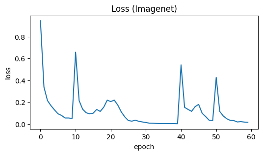

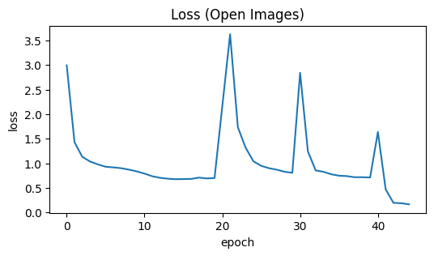

**Nature of loss curve after using Alternating Dataset:**

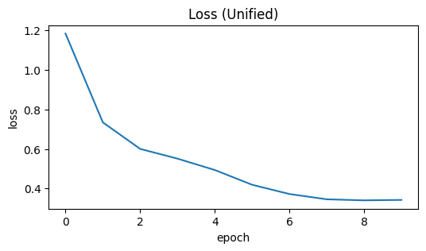

# Experiments and Workflow

## Initial Exploration

The project started with basic exploration of the Open Images dataset.

- Loaded dataset and inspected structure

- Experimented with different sampling methods

- Tested bounding box based cropping and sliding window approaches

This phase helped in designing the sample generation pipeline.

## Model Prototyping

Initial models were trained using simple CNN architectures.

- Verified data loading and preprocessing

- Tested different sampling strategies

- Refactored code multiple times as output formats evolved

Most of this work was done in early notebooks focused on sanity checks.

## ImageNet Integration

Next, ImageNet was introduced to improve dataset size and diversity.

- Implemented separate dataset loader

- Mapped synsets to target classes

- Trained models on 4-class setup (without “None”)

This phase helped improve performance on core vehicle classes.

## Final Training

Both datasets were combined using the AlternatingDataset.

- Enabled training on Open Images and ImageNet together

- Trained models for multiple epochs with checkpointing

- Experimented with different architectures, including the dual-head
  model

This phase involved long training runs and several iterations.

## Final Validation

The final model was tested using the VehicleClassifier.

- Loads trained model weights

- Applies preprocessing (resize, scaling, channel conversion)

- Outputs class predictions (0–4)

This step ensured that the model works correctly on unseen images.

# Final Model and Evaluation

The final model is based on MobileNetV3 Small using transfer learning.

- Chosen due to small size and good performance

- Modified to output predictions for the required classes

- Satisfies the model size constraint (&lt; 5 MB)

The model was trained using a combination of Open Images and ImageNet
through the AlternatingDataset.

For inference, the VehicleClassifier is used:

- Loads trained model weights

- Resizes input image to 224×224

- Scales pixel values to \[0, 1\]

- Converts image to channels-first format

The model outputs:

- 0–3 for vehicle classes

- 4 for “None of the above”

Evaluation was mainly done through validation performance and manual
testing on sample images.

# Conclusion

A complete pipeline was developed for vehicle classification, covering
dataset construction, preprocessing, model training, and evaluation.

The final solution uses a lightweight MobileNet-based model that
satisfies the size constraint while maintaining good performance.

The project involved multiple iterations and experiments, leading to a
better understanding of practical challenges in computer vision tasks.

- Over All Accuracy 92.25%

- Accuracy among Known Classes: 94.50%

- Accuracy among Unknown Classes: 92.41%
